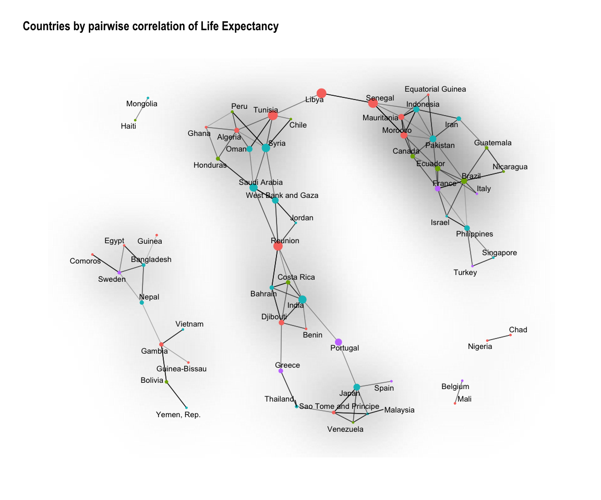

Tidygraph and ggraph
================
Ian Handel
10/12/2018

### Packages we need

``` r
library(tidyverse)
```

    ## ── Attaching packages ──────────────────────── tidyverse 1.2.1 ──

    ## ✔ ggplot2 3.1.0     ✔ purrr   0.2.5
    ## ✔ tibble  1.4.2     ✔ dplyr   0.7.8
    ## ✔ tidyr   0.8.2     ✔ stringr 1.3.1
    ## ✔ readr   1.1.1     ✔ forcats 0.3.0

    ## ── Conflicts ─────────────────────────── tidyverse_conflicts() ──
    ## ✖ dplyr::filter() masks stats::filter()
    ## ✖ dplyr::lag()    masks stats::lag()

``` r
library(tidygraph)
```

    ## 
    ## Attaching package: 'tidygraph'

    ## The following object is masked from 'package:stats':
    ## 
    ##     filter

``` r
library(ggraph)
library(widyr)
library(gapminder)
set.seed(183)
```

### Loads some data and make correlations

``` r
edges <- gapminder %>%
  select(country, year, lifeExp) %>%
  widyr::pairwise_cor(
    item = country,
    feature = year,
    value = lifeExp
  ) %>%
  filter(correlation > quantile(correlation, 0.99))
```

    ## Warning: Trying to compute distinct() for variables not found in the data:
    ## - `row_col`, `column_col`
    ## This is an error, but only a warning is raised for compatibility reasons.
    ## The operation will return the input unchanged.

``` r
edges
```

    ## # A tibble: 200 x 3
    ##    item1      item2   correlation
    ##    <fct>      <fct>         <dbl>
    ##  1 Ghana      Algeria       0.999
    ##  2 Honduras   Algeria       0.999
    ##  3 Oman       Algeria       0.999
    ##  4 Peru       Algeria       0.999
    ##  5 Syria      Algeria       0.998
    ##  6 Tunisia    Algeria       0.999
    ##  7 Costa Rica Bahrain       0.999
    ##  8 Djibouti   Bahrain       0.999
    ##  9 India      Bahrain       0.999
    ## 10 Reunion    Bahrain       0.999
    ## # ... with 190 more rows

``` r
nodes <- gapminder %>%
  select(country, continent) %>%
  distinct()
```

``` r
nodes
```

    ## # A tibble: 142 x 2
    ##    country     continent
    ##    <fct>       <fct>    
    ##  1 Afghanistan Asia     
    ##  2 Albania     Europe   
    ##  3 Algeria     Africa   
    ##  4 Angola      Africa   
    ##  5 Argentina   Americas 
    ##  6 Australia   Oceania  
    ##  7 Austria     Europe   
    ##  8 Bahrain     Asia     
    ##  9 Bangladesh  Asia     
    ## 10 Belgium     Europe   
    ## # ... with 132 more rows

``` r
net <- igraph::graph_from_data_frame(edges,
  vertices = nodes
) %>%
  as_tbl_graph() %>%
  mutate(cen = centrality_betweenness()) %>%
  filter(!node_is_isolated())
```

``` r
ggraph(net) +
  geom_edge_density(fill = "grey70") +
  geom_edge_link(aes(alpha = correlation)) +
  geom_node_point(aes(
    colour = continent,
    size = cen
  )) +
  geom_node_text(aes(label = name),
    repel = TRUE,
    check_overlap = TRUE
  ) +
  theme_graph() +
  theme(legend.position = "none") +
  labs(title = "Countries by pairwise correlation of Life Expectancy")
```

    ## Using `nicely` as default layout


